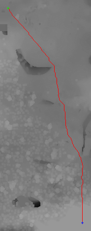
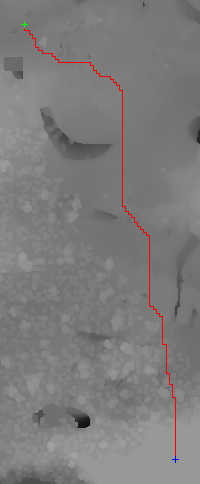
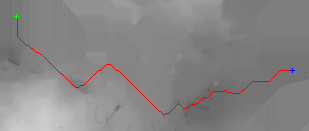
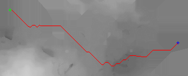

# Terrain Route Planner

A Python tool that reads Minecraft Java world files, builds a terrain heightmap, and plans a route between two points using A* pathfinding. It has three modes with different rules: **road**, **rail**, and **canal**.

I used it to plan and build an in-game road and to design a railway. I directed the project and tested every version, but the code was written with AI assistance (see [How this was built](#how-this-was-built)).

## What it does

```text
Java 1.20.2 world (.mca region files)
        |
        v
Read chunk heights  ->  build a 2D heightmap of the whole world
        |
        v
A* pathfinding between Base A and Base B (rules depend on the mode)
        |
        v
Export route (X,Y,Z CSV) + preview image
        |
        v
Build the route in-game
```

If a chunk has no usable heightmap data, the tool falls back to scanning blocks from the top of the world downward. Missing areas of the map are filled with the nearest known height so the pathfinder has no gaps.

## The three modes

| Mode | Script | Rules |
|---|---|---|
| **Road** | `ridgeway_path_mca_v7_simplified_csv.py` | Moves in 8 directions, so routes follow the terrain smoothly. Output is compressed into straight segments to make building easier. |
| **Rail** | `ridgeway_path_mca_v7_10_rail_smooth_refined.py` | Moves in 4 directions only. Maximum 1 block of height change per step. Turns are only allowed on flat ground. Penalties discourage quick successive turns. A built-in checker rejects the route if any step breaks the rail rules. |
| **Canal** | `canal_path_mca_v2_2_1.py` | Plans at a fixed water level. Digging through high terrain is expensive, terrain near water level is cheaper, turns are penalized, and the route is pulled toward the straight line between the two bases. |

## Example output

Green marks Base A, blue marks Base B, and red is the planned route. The grey background is the terrain heightmap.

**Road (left) and rail (right)**

| Road, v7 (8-direction) | Rail, v7.10 (4-direction, flat corners) |
|---|---|
|  |  |

**Canal, first version (left) and v2.2 (right)**

| Canal v1 | Canal v2.2 |
|---|---|
|  |  |

The rail route has long straight runs and right-angle steps because rails cannot turn and climb at the same time. The road does not have that limit, so it runs diagonally.

The road preview was generated by the earlier v7 script (`old_versions/ridgeway_path_mca_v7_chunkerheuristic.py`), which has the same pathfinding and also saves a preview image. The simplified version in the main folder keeps that routing and only changes the CSV output.

## Requirements

- Python 3
- `numpy`, `pillow`, `tqdm`, `scipy`, `nbtlib`
- `anvil-parser` or [`anvil-parser2`](https://github.com/0xTiger/anvil-parser2)

```bash
pip install numpy pillow tqdm scipy nbtlib anvil-parser
```

## Important: Java 1.20.2 only

The tool only worked reliably on **Java 1.20.2** worlds in my testing. Newer versions did not work with the parsing library I used. A world from another version (including Bedrock) has to be converted to Java 1.20.2 first, and then the region folder is read.

## Usage

Replace the coordinates and paths with your own.

**Road**

```bash
python ridgeway_path_mca_v7_simplified_csv.py \
    --region-dir="path/to/java_1.20.2_world/region" \
    --base-a="0,70,0" \
    --base-b="200,75,300" \
    --out-dir="output"
```

**Rail**

```bash
python ridgeway_path_mca_v7_10_rail_smooth_refined.py \
    --region-dir="path/to/java_1.20.2_world/region" \
    --base-a="0,70,0" \
    --base-b="200,75,300" \
    --out-dir="output" \
    --max-step=1 \
    --slope-weight=0.16 \
    --smooth-window=25 \
    --short-turn-penalty=0.8 \
    --min-straight-before-turn=3
```

**Canal**

```bash
python canal_path_mca_v2_2_1.py \
    --region-dir="path/to/java_1.20.2_world/region" \
    --base-a="0,70,0" \
    --base-b="200,75,300" \
    --out-dir="output" \
    --water-level=68
```

**What each script writes to the output folder**

| Script | Output |
|---|---|
| Road (`v7_simplified_csv`) | `ridgeway_path_block_v7_simplified.csv`, the route as `X,Y,Z` coordinates compressed into straight segments (no image) |
| Rail (`v7_10`) | `ridgeway_path_block_v7_10.csv` (route), `ridgeway_path_changes_v7_10.csv` (where the height changes), `ridgeway_path_visual_v7_10.png` (route preview), plus a heightmap preview and a metadata file |
| Canal (`v2_2_1`) | `canal_path_v2_2.csv` (route), `canal_path_visual_v2_2.png` (route preview), plus a heightmap preview and a metadata file |

The tool only reads the world's region files. It writes its results to the output folder and does not modify the world.

## Repository layout

```text
ridgeway_path_mca_v7_simplified_csv.py                 road
ridgeway_path_mca_v7_10_rail_smooth_refined.py         rail
canal_path_mca_v2_2_1.py                               canal
images/                                                route previews
old_versions/                                          earlier versions, kept for comparison
```

## Development history

I never overwrite a version. Every meaningful change gets a new version number, so I can compare a new version against the last working one and see exactly what changed.

- **v7**: took about a month of iteration and debugging to get right. Most of the difficulty was reading terrain data reliably from different Minecraft versions.
- **v7.5 to v7.10**: rail-specific versions. Rails have strict rules, so the road algorithm could not be reused. These versions added 4-direction movement, terrain smoothing, flat-only corners, a legality checker, and turn penalties to stop the route wiggling.
- **canal v1 to v2.2**: the same engine adapted for a canal, with water-level, excavation, and straight-line costs.

## How this was built

- **I** decided what the tool should do, wrote the rules (for example, rails cannot turn on a slope), tested each version, looked at the route previews, and debugged problems by testing against real worlds.
- **AI** wrote the code, from my instructions and my debugging feedback.

I am learning Python and working through the code to understand it properly.

## What was built from the output

- The **road** was built from the v7 route: I took the centre line and added two blocks on each side to make it five blocks wide.
- The **railway** was designed by hand after inspecting the terrain. The v7.10 route served as a reference for what a legal, natural route looks like.

## Credits

World reading uses [anvil-parser / anvil-parser2](https://github.com/0xTiger/anvil-parser2) and [nbtlib](https://github.com/vberlier/nbtlib).

## Author

Mohammed Anees Arshad

## License

No license has been granted. All rights reserved. The code is published for viewing and as a portfolio example. Please contact me if you would like to reuse it.
